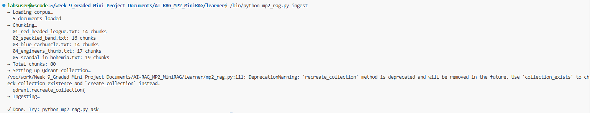
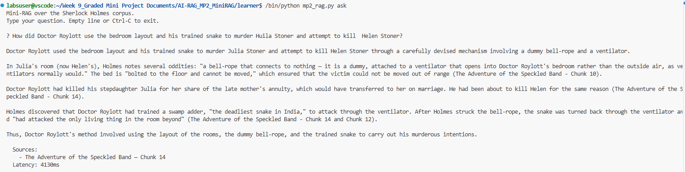
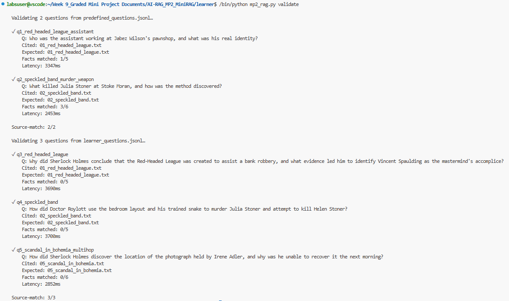

## What Worked

One aspect that worked particularly well was the overlapping chunking strategy implemented in chunk_document(). By using a chunk size of 500 characters with an overlap of 80 characters, important information that spans chunk boundaries is less likely to be lost during retrieval.

For example:

TARGET_CHUNK_SIZE = 500
CHUNK_OVERLAP = 80

This overlap helped preserve context between adjacent chunks, increasing the likelihood that related facts remained available for retrieval. It also improved answer quality for questions requiring multiple connected details because relevant information often appeared in neighboring chunks.

Another successful design choice was retrieving more chunks than the final answer parameter requests:

retrieval_k = max(k, 8)

Even when k=3 is passed, the system retrieves up to eight potentially relevant chunks. This increases the amount of context available to the language model and reduces the risk of missing important evidence needed to answer complex questions.

## What Didn't Work

One challenge was that the system relies entirely on dense vector similarity retrieval using embeddings:

response = qdrant.query_points(
collection_name=COLLECTION_NAME,
query=query_vector,
limit=k,
with_payload=True,
)

In some cases, vector retrieval may return semantically similar chunks that are not the most factually relevant. Questions involving specific names, locations, identities, or exact events can be difficult because semantic search does not always prioritize exact keyword matches.

Another limitation was that all retrieved chunks are included in the citation list:

citations.append(
{
"source": chunk["source"],
"title": chunk["title"],
"section": chunk["section"]
}
)

Some retrieved chunks may contribute little or nothing to the final answer, yet they still appear as citations. This can make it harder to determine which retrieved passages were actually used by the model.

Additionally, validation uses exact text matching:

fact.lower() in ans_lower

This means a fact can be semantically correct but still not count as a match if the wording differs from the expected phrase. As a result, evaluation scores may sometimes underestimate actual answer quality.

## What I Would Improve

The first improvement would be implementing hybrid retrieval, combining vector search with keyword-based retrieval. This would help retrieve chunks containing important names, clues, or specific terms while still benefiting from semantic understanding.

The second improvement would be introducing a reranking step after retrieval. Instead of directly sending the top vector-search results to the LLM, a reranker could reorder retrieved chunks based on their relevance to the question. This would reduce noise and improve context quality.

I would also improve chunk metadata by storing character positions or paragraph numbers in addition to chunk numbers. This would provide more precise citations and make it easier to trace answers back to the original source text.

Finally, I would optimize prompt size and context management. Although retrieving eight chunks improves recall, it can also introduce irrelevant information. A relevance-filtering step before generation could balance completeness with precision and reduce token usage.

## One surprise

One thing that genuinely surprised me was how much prompt engineering influenced answer quality without changing the retrieval system.

The detailed instructions in the system prompt:

- Answer every part of the question.
- Preserve important factual statements from the excerpts.
- Prefer the exact wording of the excerpts.
- Do not invent information.
- Include citations.

produced noticeably better answers than a simple question-answering prompt. The model became much more disciplined about staying within the provided context, preserving important details, and citing sources correctly. I expected retrieval quality to be the largest factor, but the improvement gained from carefully crafted grounding instructions was larger than anticipated and had a significant impact on factual completeness.

### Output of mp2_rag.py

## 1. Ingest

## 2. ask

## 3. Validate
